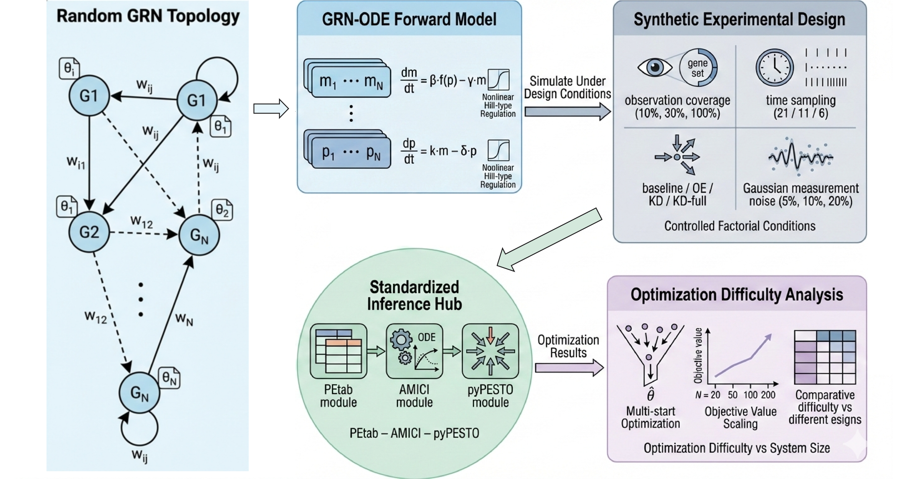

# GRN Synthetic Benchmark

This repository implements an end-to-end synthetic benchmark for **Gene Regulatory Network (GRN) ODE models**, including:

1. **YAML-driven** GRN model + experimental design configuration  
2. Synthetic **time-course data generation** with observation subsampling, perturbations, and Gaussian noise  
3. Export of each experiment instance into a **PEtab parameter estimation problem** (SBML + TSV tables)  
4. Parameter estimation via **pyPESTO multi-start local optimization** (AMICI simulator)

> Scope note: This code focuses on **multi-start optimization**. It does **not** implement profile likelihood or Bayesian sampling.



---

## Repository Structure

```
CODE_FINAL/
├── configs/
│   ├── grn_config.yaml        # GRN model priors and network design
│   └── grn_experiment.yaml    # Experiment grid and design settings
├── models/
│   ├── base_model.py
│   └── grn_model.py           # GRN ODE model definition
├── simulator/
│   └── GRN_synthetic.py       # Synthetic data generation via ODE simulation
├── utils/
│   └── config_utils.py
├── export.py                  # Export to SBML + PEtab
├── generate_data.py           # Generate experiment grid and PEtab problems
├── fit_petab_multistart.py    # pyPESTO multi-start optimization
├── run.sh                     # Batch fitting script
└── README.md
```


## Requirements

Core dependencies (Python):

- `numpy`, `scipy`, `pyyaml`, `pandas`
- `python-libsbml`
- `amici`
- `pypesto` (with `pypesto.petab`)


```bash
pip install numpy scipy pyyaml pandas python-libsbml
pip install amici pypesto petab
```

### 1) Generate synthetic experiments + export to PEtab

You generate a grid of experiment instances by modifying configs/grn_experiment.yaml (base template), then writing each instance to:

```python
data_gene200/<case_name>/experiment.yaml
data_gene200/<case_name>/petab/petab.yaml
..
```

```bash
python generate_data.py
```

For each combination of:

- `net ∈ {0,1,2}` (used as `experiment.random_seed`)
- `obs ∈ {0.3, 1.0}` (subset vs. all observed genes)
- `t ∈ {dense, sparse}` (time sampling mode)
- `p ∈ {baseline, kd_full}` (perturbation mode)
- noise mode fixed to `"medium"`

it will:

1. write an `experiment.yaml` under the corresponding case folder
2. call `export_grn_petab_with_sbml(experiment.yaml, petab/)`

### 2) What gets exported

Each experiment instance is exported as a self-contained PEtab problem:
```
petab/
├── model.xml          # SBML model (rate rules)
├── observables.tsv
├── conditions.tsv
├── measurements.tsv
├── parameters.tsv
└── petab.yaml
```

**Key conventions:**

- SBML follows *Scheme A* with species `m1..mN` and `p1..pN`
- Initial conditions are specified in `conditions.tsv` (species overrides)
- Only protein species are observable (`obs_p<i>`)
- Gene-level kinetic parameters are estimated by default
- Edge-specific Hill parameters are fixed to the sampled instance
- Noise parameters are fixed per noise design


### 3) Run parameter estimation (batch multi-start)

The batch script scans for all PEtab problems under ROOT_DIR and fits each with multi-start optimization.

```bash
bash run.sh
```
### 4) Single-case fitting

If you just want to run one case directly:

```python
python fit_petab_multistart.py \
  --petab_yaml data_gene200/<case>/petab/petab.yaml \
  --n_starts 10 \
  --n_procs 8 \
  --optimizer scipy \
  --out_hdf5 data_gene200/<case>/fit/result.hdf5 \
  --summary_json data_gene200/<case>/fit/summary.json
```
